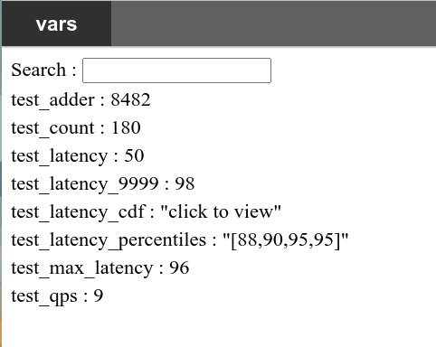
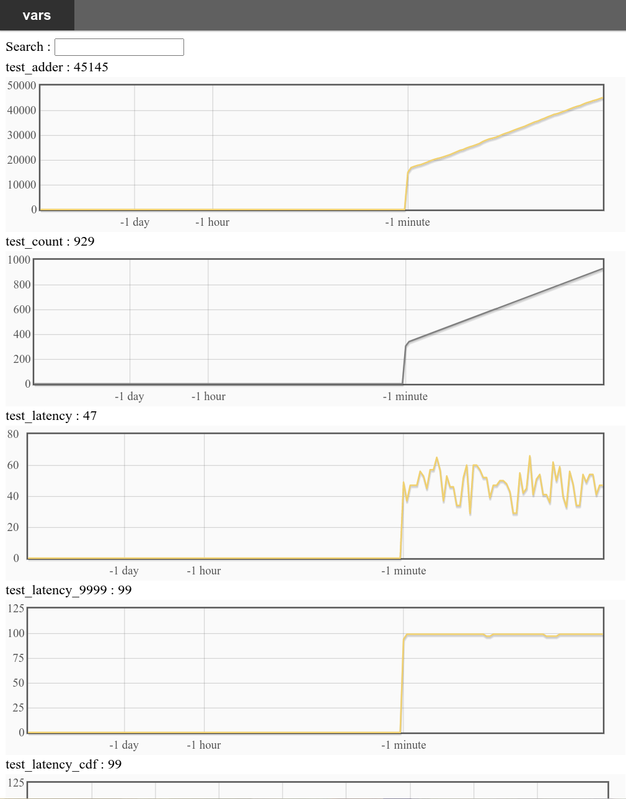

# Introduce
GoMark is a tool for system status monitoring and it implements some variables exactly like bvar in brpc, but using go instead of c++.

For more detailed information, see:
https://github.com/apache/incubator-brpc/blob/master/docs/en/bvar.md


# Usage
## Init
gomark monitor variable statistics through HTTP web server, so you need call
```go
StartHTTPServer(port int)
```
to start HTTP service before using.

## Variable Create
A variable is an entity that maintains all information of statistics. There are several variables, and can be created by:
```
NewLatencyRecorder
NewAdder
NewCounter
NewQPS
NewMaxer
NewWindowMaxer
```

Each of above will create a variable and returns as `gmi.Marker`, which is an interface:
```go
// Marker is an interface to provide variable marking.
type Marker interface {
	// Mark a number, the number definition is bound to marker itself.
	Mark(n int32)
	// Stop this marking.
	Cancel()
}
```

Call `Mark` to send a marking point to variable and `Cancel` to stop using(and never use it).

# Working with C/CPP
gomark is designed to work on GO. But it also provide an adapter to work with C/CPP.

[adapter](adapter) provide C interfaces to call variable create/mark/cancel of gomark package. It works along with [hook](hook), which is a sub-project of gomark compiling to be a dynamic library `libgmhook.so` for C/CPP users.

This is how it works: 
1. gomark user calls `adapter.StartAdapter` to enable [hook](hook) connected with gomark by registering C callbacks to create/mark/cancel variables(`register_gm_hook`).
2. C program working with gomark should directly call `gm_var_create`/`gm_var_mark`/`gm_var_cancel` in `libgmhook.so` to use gomark through adapter(adatper will call registered gomark callbacks).
3. CPP program working with gomark may delcare `GmVariable` defined in [gmhookpp](hook/gmhookpp.h) to use gomark also through adatper.

To use this feature, gomark user need:
1. make hook and install, see [readme](hook/README.md)
2. GO program should call `adapter.StartAdapter`
3. add these two CGO flags in environment before building to let adapter found `libgmhook.so` and `gmhook.h`
```sh
export CGO_CFLAGS="-I/path_to_install_of_hook/include"
export CGO_LDFLAGS="-L/path_to_install_of_hook/lib -lgmhook"
```

## Example

[example](cmd/example/example.go) shows how to use adder and latency recorder. Actually all variables are used in the same way:
1. create
2. mark int32 values
3. cancel


# Monitor

Visit http://ip:port/vars to monitor system statistics.

This is how it looks like:


You may click those clickable records, and you will see:



# Performance
Test method: in one goroutine, continuouesly marking for 10 million marks, get the time elasped and
calculate how many marks can be done in one second(QPS).


updated 2020.11.19

| Variable        | QPS     |
| --              | --      |
| MaxWindow       | 6214338 |
| Maxer           | 6497730 |
| Adder           | 6445707 |
| LatencyRecorder | 5411037 |
| QPS             | 6837910 |
| Counter         | 6163937 |


# Test
`cmd/main/gomark.go` is used run tests. It use glog for logging, so add ` -stderrthreshold=INFO` in command line:
```
go run gomark.go -stderrthreshold=INFO 
```
Read the usage and run test.


